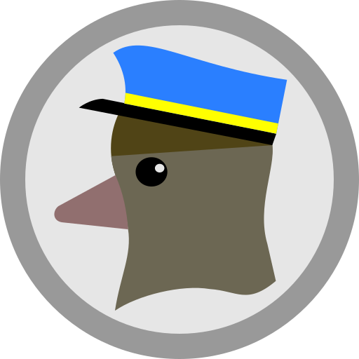
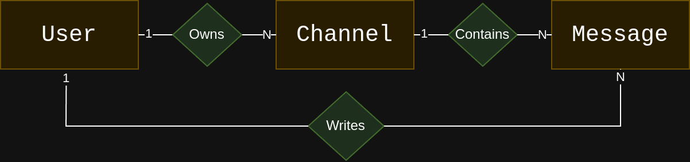

# ChatApp Server (see in [🇺🇸](docs/README-en_us.md))

O ChatApp Server é o serviço backend que alimenta o aplicativo *mobile* ChatApp. Ele fornece uma API que gerencia funcionalidades como envio de mensagens, autenticação e canais de chat para o app.

Este servidor foi desenvolvido como parte de um projeto educacional na disciplina de Programação de Dispositivos Móveis do **IFTM – Campus Uberaba Parque Tecnológico (UPT)**, ministrada por [Vinícius F. Maciel](https://github.com/ViniciusFM). Tanto o cliente *mobile* ChatApp quanto o backend ChatApp Server foram projetados para explorar práticas de desenvolvimento em tecnologias móveis e web.

O servidor é distribuído sob a licença [GNU Affero General Public License (AGPLv3)](LICENSE), garantindo transparência, colaboração aberta e acesso ao código-fonte para fins de aprendizado e aprimoramento.

Veja a [Documentação da API](docs/api_docs.md) para saber mais.



## Objeto User

| Atributo     | Tipo  | Descrição                 |
|--------------|-------|---------------------------|
| id           | int64 | ID na base de dados       |
| uuid         |  str  | Identificador do usuário  |
| name         |  str  | Nome do usuário           |
| email        |  str  | Endereço google account   |

## Objeto Channel

Os canais podem ser compostos de um ou mais usuário. Um usuário admin
irá criá-lo

| Atributo     | Tipo  | Descrição                     |
|--------------|-------|-------------------------------|
| id           | int64 | ID na base de dados           |
| uuid         |  str  | Identificador do canal        |
| alias        |  str  | Nome do canal                 |
| img_res      |  str  | UUID da imagem do canal       |
| admin_id     | int64 | ID do administrador do canal  |

## Objeto Message

As mensagens estão contidas nos canais. Cada canal possui um conjunto
de mensagens, mas uma mensagem tem apenas um canal a qual ela pertence.
As mensagens são assinadas por usuários.

| Atributo     | Tipo  | Descrição                                             |
|--------------|-------|-------------------------------------------------------|
| id           | int64 | Número identificador da mensagem                      |
| channel_id   | int64 | Número identificador do canal que armazena a mensagem |
| user_id      | int64 | Número identificador do usuário que enviou a mensagem |
| text         | str   | Texto da mensagem enviada                             |
| creation_ts  | str   | Data de registro da mensagem                          |

## Diagrama de dados



## Configurando o servidor

1) Baixar o python 3.x
2) Instalar o **virtualenv**:
```bash
pip3 install virtualenv
```
3) Criar um ambiente virtual
```bash
virtualenv .venv
```
4) Entrar no ambiente virtual toda vez que for executar o ChatAppServer
```bash
# No unix-like
source ./.venv/bin/activate

# No windows
.\.venv\Scripts\activate

# para desativar
deactivate
```
5) Instalar as dependencias do projeto
```bash
pip install -r requirements.txt
```
> OBS: caso você adicione mais uma biblioteca no projeto, recomenda-se executar: pip freeze > requirements.txt
6) Crie um arquivo `config.json` à exemplo do arquivo `config-example.json`.
    * Para criar um valor para o parâmetro `SECRET_KEY` de `config.json` execute:
    ```python
    python -c "import secrets; print(secrets.token_hex(32))"
    ```
    * Repita o mesmo passo anterior para criar um valor para `SECRET_CAPTCHA_KEY`, para uso do captcha.
    * Copie o valor gerado para o arquivo de configuração.
    * No *array* `RESTRICT_TO` adicione regras (*regex*) e/ou endereços específicos de e-mail para restringir o acesso ao serviço. Se você deletar a regra ou deixar o *array* vazio, o acesso será irrestrito a qualquer conta Google.
    * Complete o arquivo de configuração com o ID da aplicação de autenticação criada no Google Cloud Console. Para saber como realizar esse passo vá para o tutorial [docs/google_auth_config.md](docs/google_auth_config.md)
7) Executar a aplicação flask localmente:
```bash
flask run --debug --host=0.0.0.0 --port=5000
```
8) Utilize uma aplicação para testar a API. Sugestões:
    * [Insomnia](https://insomnia.rest/download)
    * [Postman](https://www.postman.com/)
