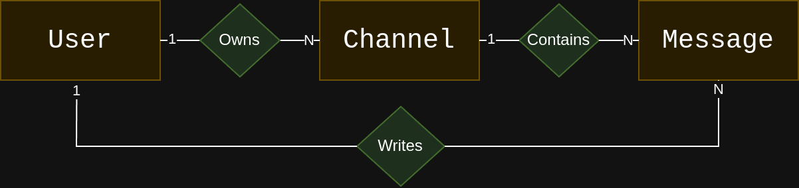

# ChatApp Server (ver em [🇧🇷](../README.md))

ChatApp Server is the backend service that powers the *mobile* application ChatApp. It provides an API that handles functionalities such as message sending, authentication, and chat channels for the app.

This server was developed as part of an educational project in the Mobile Device Programming course at **IFTM – Campus Uberaba Parque Tecnológico (UPT)**, taught by [Vinícius F. Maciel](https://github.com/ViniciusFM). Both the ChatApp *mobile* client and the ChatApp Server backend were designed to explore development practices in mobile and web technologies.

The server is distributed under the [GNU Affero General Public License (AGPLv3)](../LICENSE), ensuring transparency, open collaboration, and access to the source code for learning and improvement purposes.

## User Object

| Attribute | Type  | Description            |
| --------- | ----- | ---------------------- |
| id        | int64 | Database ID            |
| uuid      | str   | User identifier        |
| name      | str   | User name              |
| email     | str   | Google account address |

## Channel Object

Channels can consist of one or more users. An admin user will create it.

| Attribute | Type  | Description               |
| --------- | ----- | ------------------------- |
| id        | int64 | Database ID               |
| uuid      | str   | Channel identifier        |
| alias     | str   | Channel name              |
| img\_res  | str   | UUID of the channel image |
| admin\_id | int64 | Channel administrator ID  |

## Message Object

Messages are contained within channels. Each channel has a set of messages, but a message belongs to only one channel. Messages are signed by users.

| Attribute    | Type  | Description                                   |
| ------------ | ----- | --------------------------------------------- |
| id           | int64 | Message identifier number                     |
| channel\_id  | int64 | Identifier of the channel storing the message |
| user\_id     | int64 | Identifier of the user who sent the message   |
| text         | str   | Text of the sent message                      |
| creation\_ts | str   | Timestamp of message creation                 |

## Data diagram



## Setting up the server

1. Download Python 3.x
2. Install **virtualenv**:

```bash
pip3 install virtualenv
```

3. Create a virtual environment

```bash
virtualenv .venv
```

4. Enter the virtual environment every time you run ChatAppServer

```bash
# On unix-like
source ./.venv/bin/activate

# On windows
.\.venv\Scripts\activate

# to deactivate
deactivate
```

5. Install project dependencies

```bash
pip install -r requirements.txt
```

> NOTE: If you add any new libraries to the project, it is recommended to run: pip freeze > requirements.txt

6. Create a `config.json` file based on the `config-example.json` file.

   * To create a value for the `SECRET_KEY` parameter in `config.json`, run:

   ```python
   python -c "import secrets; print(secrets.token_hex(32))"
   ```

   * Repeat the same step above to create a value for `SECRET_CAPTCHA_KEY`, used for captcha.
   * Copy the generated values into the configuration file.
   * In the `RESTRICT_TO` *array*, add rules (regex) and/or specific email addresses to restrict access to the service. If you delete the rule or leave the array empty, access will be unrestricted to any Google account.
   * Complete the configuration file with the application ID from the authentication app created in Google Cloud Console. For instructions on how to do this, see the tutorial [docs/google\_auth\_config_en_us.md](google\_auth\_config_en_us.md)
7. Run the flask application locally:

```bash
flask run --debug --host=0.0.0.0 --port=5000
```

8. Use an application to test the API. Suggestions:

   * [Insomnia](https://insomnia.rest/download)
   * [Postman](https://www.postman.com/)
